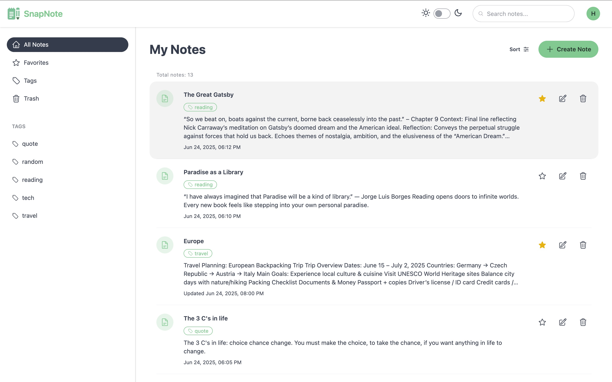
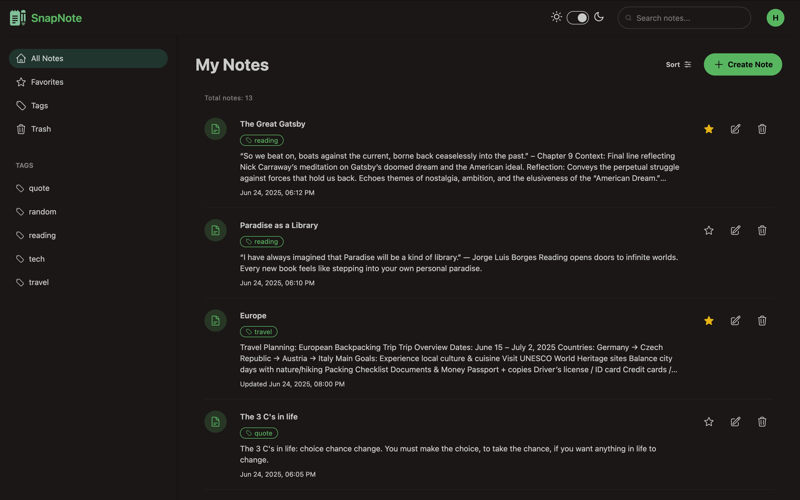
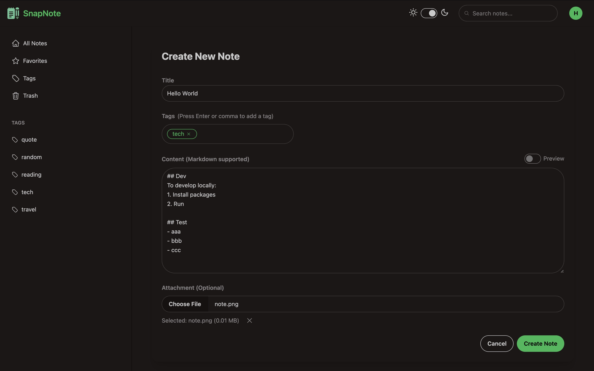
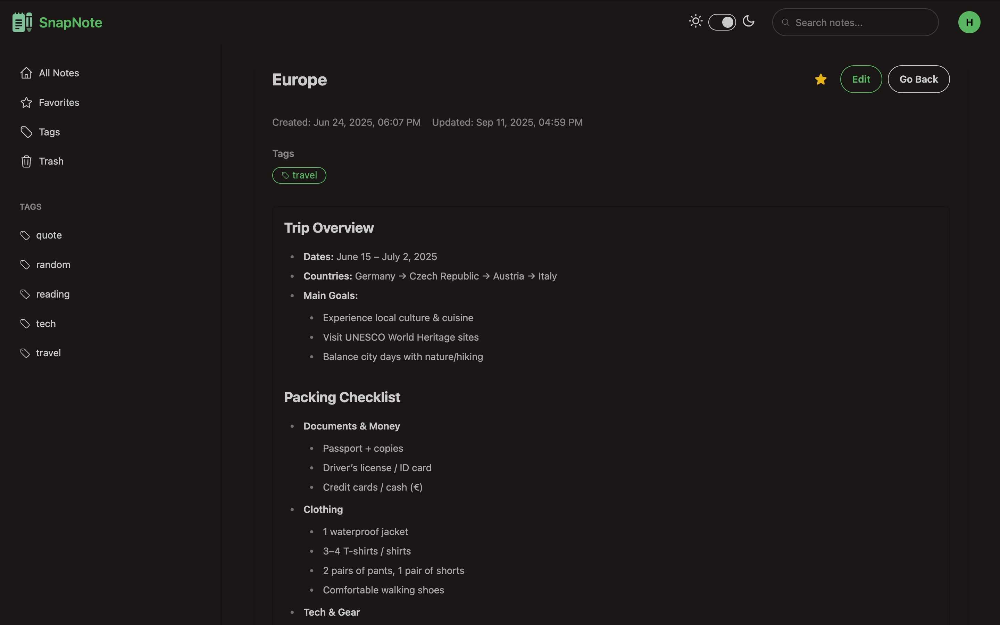

# SnapNote

A simple, modern note-taking app built with AWS serverless technologies and React + TypeScript frontend.

## Features

- User signup and login
- Create and edit notes, with Markdown support
- Attach files to notes
- Delete and restore notes from trash
- Favorite notes for quick access
- Tag notes for easy organization

## Tech Stack

- **Backend (AWS Serverless)**
  - **Lambda** & API Gateway - Serverless APIs
  - **DynamoDB** - NoSQL database for note storage
  - **S3** - File uploads
  - **Cognito** - User authentication
- **Frontend**
  - **React + TypeScript** - Modern UI framework
  - **Vite** - Fast build tool
  - **TailwindCSS + DaisyUI** - Utility-first styling

## Getting Started

### Local Development

```sh
npx sst dev
```

### Deploy to Production

```sh
npx sst deploy --stage production
```

## Project Structure

- `infra/` – Infrastructure as code (SST, AWS resources)
- `packages/functions/` – Lambda function source code
- `packages/frontend/` – React frontend app
- `packages/core/` – Shared utilities and types

## Screenshots





